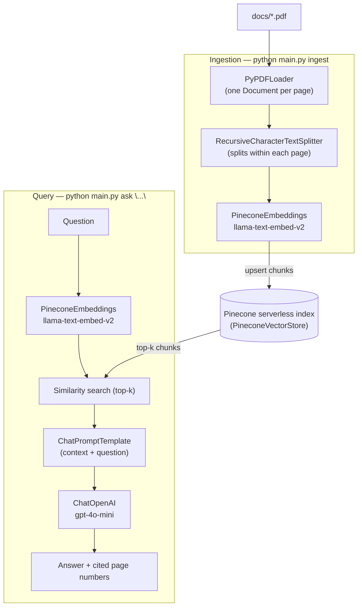

# PDF RAG with Pinecone + LangChain

Retrieval-augmented generation over the PDF(s) in `docs/`.

- **Chunking**: each PDF page is loaded as its own `Document` (`PyPDFLoader`), then
  `RecursiveCharacterTextSplitter` splits within each page — so chunks respect
  page boundaries and every chunk keeps its `page` metadata.
- **Embeddings**: Pinecone's hosted inference model `llama-text-embed-v2`, via
  `langchain-pinecone`'s `PineconeEmbeddings`.
- **Vector store**: Pinecone serverless index, via `PineconeVectorStore`.
- **Generation**: OpenAI, via `langchain-openai`'s `ChatOpenAI` (default `gpt-4o-mini`).
  (Pinecone doesn't expose a standalone generation model outside its separate,
  auto-chunking Assistant product, so generation is done with an LLM here.)

## Architecture



## Setup

```bash
python3 -m venv .venv   # Python 3.12 recommended (3.14 breaks a langchain-pinecone dep)
source .venv/bin/activate
pip install -r requirements.txt
cp .env.example .env    # then fill in PINECONE_API_KEY and OPENAI_API_KEY
```

## Usage

```bash
# Chunk docs/*.pdf and upsert into Pinecone
python main.py ingest

# Ask a question
python main.py ask "What are the main risk factors disclosed in this filing?"
```

## Config

All settings are environment variables (see `.env.example`): index name/cloud/region/
namespace, embedding model + dimension, generation model, chunk size/overlap, and
retrieval top-k.
