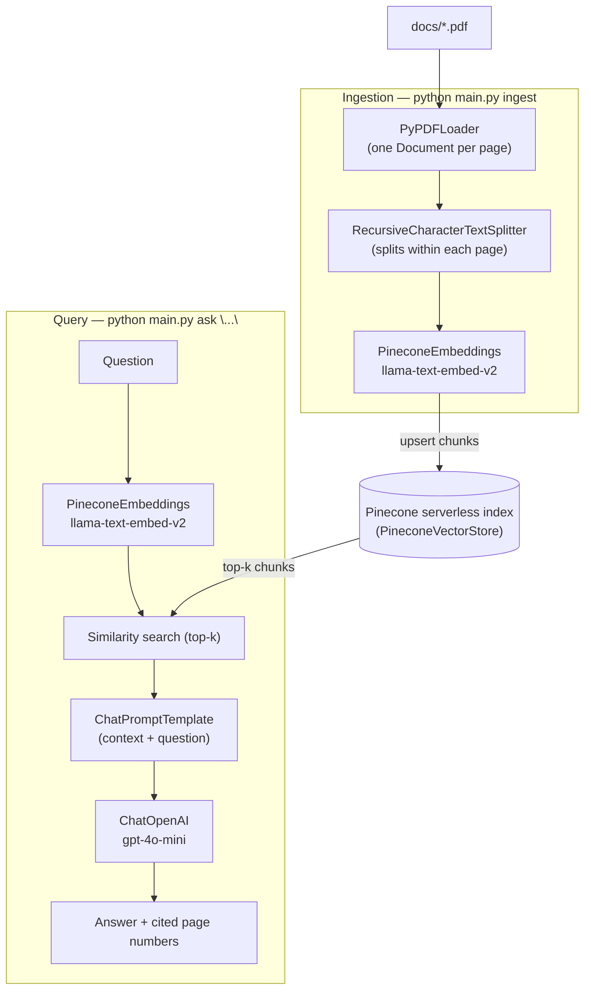
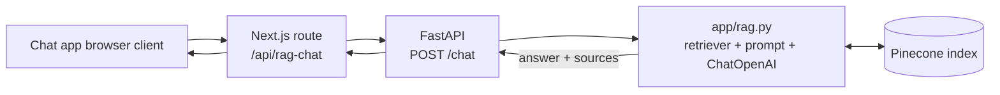

# PDF RAG with Pinecone + LangChain

Retrieval-augmented generation over the PDF(s) in `docs/`.

- **Chunking**: each PDF page is loaded as its own `Document` (`PyPDFLoader`), then
  `RecursiveCharacterTextSplitter` splits within each page — so chunks respect
  page boundaries and every chunk keeps its `page` metadata.
- **Embeddings**: Pinecone's hosted inference model `llama-text-embed-v2`, via
  `langchain-pinecone`'s `PineconeEmbeddings`.
- **Vector store**: Pinecone serverless index, via `PineconeVectorStore`.
- **Generation**: OpenAI, via `langchain-openai`'s `ChatOpenAI` (default `gpt-4o-mini`).
  (Pinecone doesn't expose a standalone generation model outside its separate,
  auto-chunking Assistant product, so generation is done with an LLM here.)

## Architecture



Both the CLI (`main.py`) and the API (`app/server.py`) share the same `app/rag.py` retrieval + generation chain.



## Setup

```bash
python3 -m venv .venv   # Python 3.12 recommended (3.14 breaks a langchain-pinecone dep)
source .venv/bin/activate
pip install -r requirements.txt
cp .env.example .env    # then fill in PINECONE_API_KEY and OPENAI_API_KEY
```

## Usage

```bash
# Chunk docs/*.pdf and upsert into Pinecone
python main.py ingest

# Ask a question
python main.py ask "What are the main risk factors disclosed in this filing?"
```

## Run as an API

The same retrieval + generation chain is also exposed over HTTP via FastAPI, so
other apps (e.g. a chat frontend) can call it:

```bash
uvicorn app.server:app --reload --port 8000
```

- `GET /health` — liveness check.
- `POST /chat` — body `{"messages": [{"role": "user", "content": "..."}]}`,
  returns `{"text": "...", "sources": [{"source": "...", "page": 3}, ...]}`.
  Only the last `user` message is used as the retrieval query.

```bash
curl -X POST http://localhost:8000/chat \
  -H "Content-Type: application/json" \
  -d '{"messages":[{"role":"user","content":"What fiscal year does this filing cover?"}]}'
```

Set `CORS_ORIGINS` (comma-separated, default `http://localhost:3000`) to allow
the calling frontend's origin.

### Integration with my_test_chat_app

[my_test_chat_app](https://github.com/achyutasvm/my_test_chat_app) is a Next.js
chat app. It calls this service via a server-side proxy route
(`app/api/rag-chat/route.ts`) under a "Document Q&A" mode, alongside its
existing general-purpose Gemini chat. Run both services locally and set
`RAG_API_URL=http://localhost:8000` in that app's `.env.local` to connect them.

## Config

All settings are environment variables (see `.env.example`): index name/cloud/region/
namespace, embedding model + dimension, generation model, chunk size/overlap, and
retrieval top-k.
