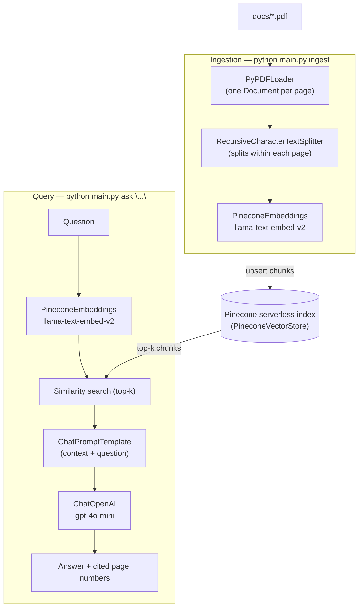
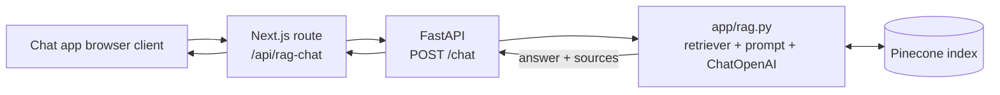

# PDF RAG with Pinecone + LangChain

Retrieval-augmented generation over the PDF(s) in `docs/`.

- **Chunking**: each PDF page is loaded as its own `Document` (`PyPDFLoader`), then
  `RecursiveCharacterTextSplitter` splits within each page — so chunks respect
  page boundaries and every chunk keeps its `page` metadata.
- **Embeddings**: Pinecone's hosted inference model `llama-text-embed-v2`, via
  `langchain-pinecone`'s `PineconeEmbeddings`.
- **Vector store**: Pinecone serverless index, via `PineconeVectorStore`.
- **Generation**: OpenAI, via `langchain-openai`'s `ChatOpenAI` (default `gpt-4o-mini`).
  (Pinecone doesn't expose a standalone generation model outside its separate,
  auto-chunking Assistant product, so generation is done with an LLM here.)

## Architecture


```mermaid
flowchart TB
    PDF["docs/*.pdf"]

    subgraph ingest["Ingestion — python main.py ingest"]
        direction TB
        Loader["PyPDFLoader\n(one Document per page)"]
        Splitter["RecursiveCharacterTextSplitter\n(splits within each page)"]
        EmbedDocs["PineconeEmbeddings\nllama-text-embed-v2"]
        Loader --> Splitter --> EmbedDocs
    end

    Index[("Pinecone serverless index\n(PineconeVectorStore)")]

    subgraph query["Query — python main.py ask \"...\""]
        direction TB
        Question["Question"]
        EmbedQuery["PineconeEmbeddings\nllama-text-embed-v2"]
        Retrieve["Similarity search (top-k)"]
        Prompt["ChatPromptTemplate\n(context + question)"]
        LLM["ChatOpenAI\ngpt-4o-mini"]
        Answer["Answer + cited page numbers"]
        Question --> EmbedQuery --> Retrieve --> Prompt --> LLM --> Answer
    end

    PDF --> Loader
    EmbedDocs -- "upsert chunks" --> Index
    Index -- "top-k chunks" --> Retrieve
```

Both the CLI (`main.py`) and the API (`app/server.py`) share the same `app/rag.py` retrieval + generation chain.


```mermaid
flowchart LR
    Browser["Chat app browser client"]
    NextRoute["Next.js route\n/api/rag-chat"]
    FastAPI["FastAPI\nPOST /chat"]
    RAGChain["app/rag.py\nretriever + prompt + ChatOpenAI"]
    PineconeIdx[("Pinecone index")]

    Browser --> NextRoute --> FastAPI --> RAGChain
    RAGChain <--> PineconeIdx
    RAGChain -- "answer + sources" --> FastAPI --> NextRoute --> Browser
```

## Setup

```bash
python3 -m venv .venv   # Python 3.12 recommended (3.14 breaks a langchain-pinecone dep)
source .venv/bin/activate
pip install -r requirements.txt
cp .env.example .env    # then fill in PINECONE_API_KEY and OPENAI_API_KEY
```

## Usage

```bash
# Chunk docs/*.pdf and upsert into Pinecone
python main.py ingest

# Ask a question
python main.py ask "What are the main risk factors disclosed in this filing?"
```

## Run as an API

The same retrieval + generation chain is also exposed over HTTP via FastAPI, so
other apps (e.g. a chat frontend) can call it:

```bash
uvicorn app.server:app --reload --port 8000
```

- `GET /health` — liveness check.
- `POST /chat` — body `{"messages": [{"role": "user", "content": "..."}]}`,
  returns `{"text": "...", "sources": [{"source": "...", "page": 3}, ...]}`.
  Only the last `user` message is used as the retrieval query.
- `POST /ingest` — multipart upload, field name `file` (PDF only, 25MB max).
  Saves the file into `docs/`, then chunks/embeds/upserts it, same as
  `python main.py ingest`. Returns `{"filename", "pages", "chunks"}`.

```bash
curl -X POST http://localhost:8000/chat \
  -H "Content-Type: application/json" \
  -d '{"messages":[{"role":"user","content":"What fiscal year does this filing cover?"}]}'

curl -X POST http://localhost:8000/ingest -F "file=@docs/some-report.pdf"
```

Set `CORS_ORIGINS` (comma-separated, default `http://localhost:3000`) to allow
the calling frontend's origin.

### Integration with my_test_chat_app

[my_test_chat_app](https://github.com/achyutasvm/my_test_chat_app) is a Next.js
chat app. It calls this service via a server-side proxy route
(`app/api/rag-chat/route.ts`) under a "Document Q&A" mode, alongside its
existing general-purpose Gemini chat. That app also supports a second,
Qdrant-backed RAG service as an alternative — a per-question selector picks
which one to call. Run this service locally and set
`RAG_API_URL_PINECONE=http://localhost:8000` in that app's `.env.local` to
connect this one.

## Evaluation

`eval/` runs an "LLM-as-a-judge" check on the pipeline's answer quality:

```bash
python eval/generate_answers.py   # runs eval/QUESTIONS through the real app/rag.py pipeline
python eval/evaluate_answers.py   # has two independent models judge each answer correct/incorrect
```

Needs `GROQ_API_KEY` ([console.groq.com](https://console.groq.com), free tier)
and `GOOGLE_API_KEY` ([aistudio.google.com/apikey](https://aistudio.google.com/apikey))
in `.env`, in addition to the main pipeline's keys. Output goes to
`eval/output/` (gitignored — it's generated data, not source): `responses.json`
from step one, `evaluation.json`/`evaluation.csv` from step two.

Two things worth knowing before running it:
- **Judge model names go stale.** Both judge models here have already been
  swapped once after the provider retired the original one (see git history
  in `eval/evaluate_answers.py`) — a `model not found` error means checking
  the provider's current model list and updating `JUDGES`.
- **Gemini's free tier caps at 20 requests/day, per project** (not per key —
  a new key under the same project doesn't reset it). `evaluate_answers.py`
  fails fast on a quota error instead of retrying (retrying just burns the
  same scarce quota faster) and saves/resumes incrementally, so a run
  interrupted by quota only needs to redo what wasn't already judged.

## Config

All settings are environment variables (see `.env.example`): index name/cloud/region/
namespace, embedding model + dimension, generation model, chunk size/overlap, and
retrieval top-k.
